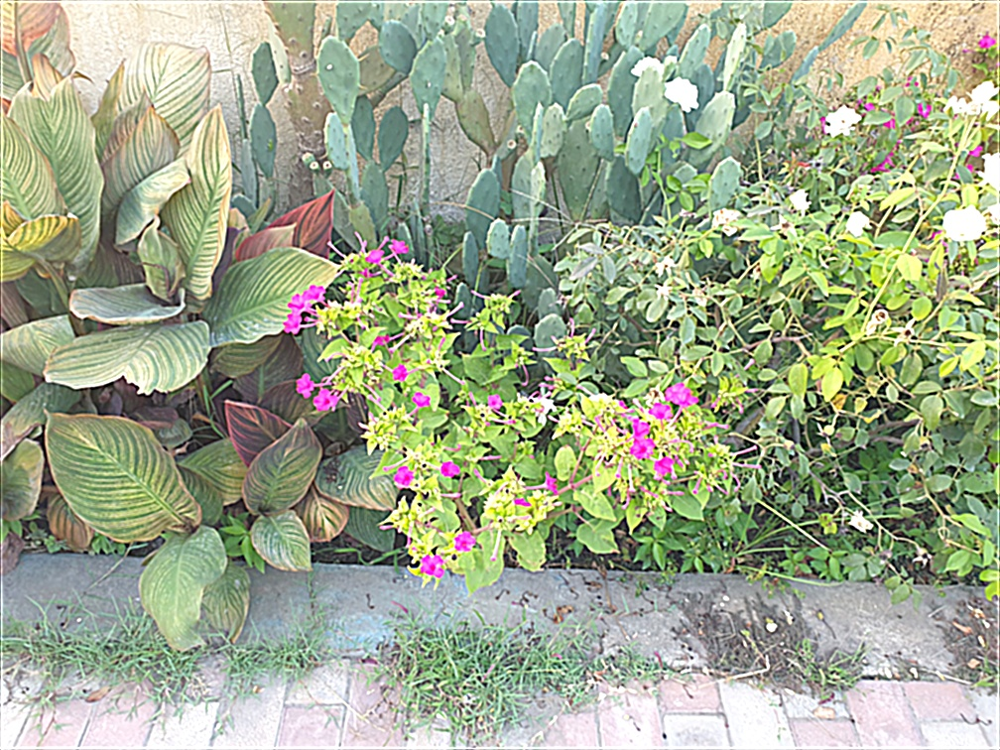
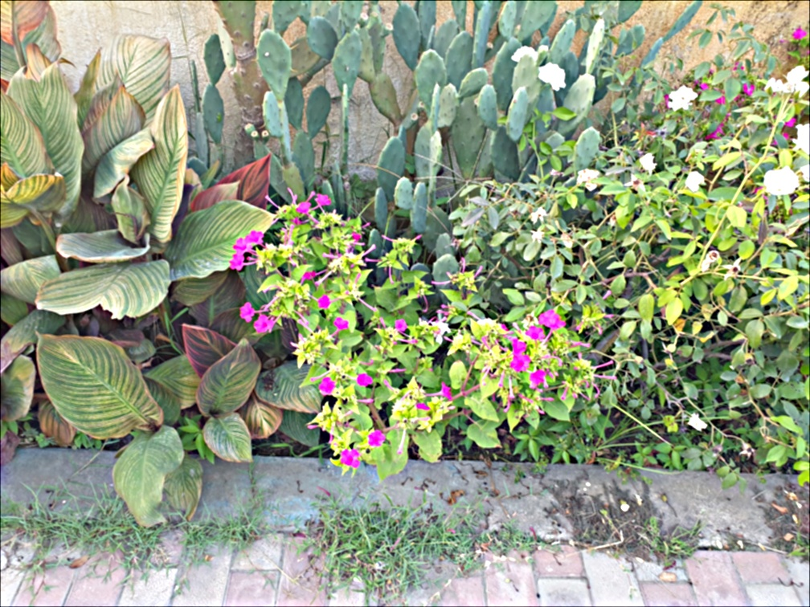
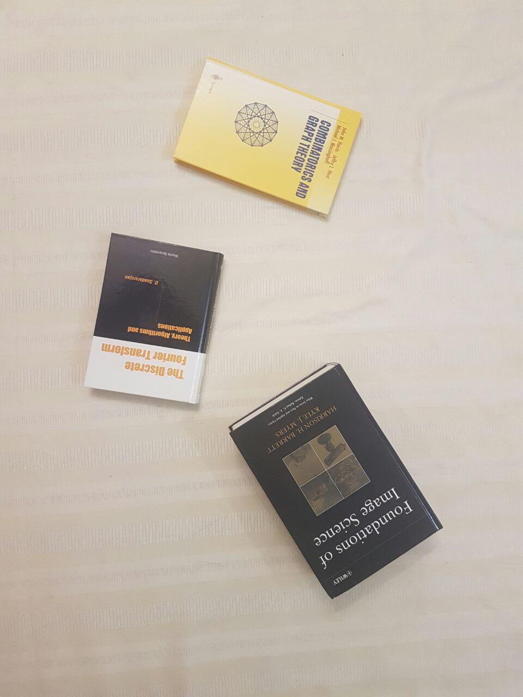

# Image_Processing_Course
Image Processing Course Assignments

## HW1
### Q1 and Q2
These questions are about enhancing two dark photo's qualities

### Q3
In Q3 I wrote a code to convert [Prokudin-Gorskii](https://www.loc.gov/pictures/collection/prok/ "Prokudin-Gorskii images") black and white images to colory jpg images. The Prokudin-Gorskii' images are in .tif format with separated blue, red, and green channels. q3.py can convert them properly.

### Q4
A simple program to change an image's color and blur it

### Q5
Filtering an image by using OpenCV, double for implementation, and matrix addition method.

### Q6
Histogram specification code to enhance an image's quality

___
## HW2

### Q1, Image sharpening techniques:
Image sharpaening using spatial and frequency domain tools. Original image is blured and we wish to sharp it using unsharp mask. This is the original, non sharp image:

The sharped images are as below:
|   |  |
| ------------- | ------------- |
|   |   |

### Q2, Simple template matching problem:
In this problem I used zero mean cross correlation method to match a given template with an image. The patch is a pipe which we want to find it in image. The result is as below:

### Q3:
In this problem we want to extract three books form an image. The books are rotated and there is a little perspective in the picture which makes it a bit hard to derive best results. I choosed every four corner of each book and fitted a homography transformation using opencv. Finally the image is warped using myWarpFunction - which I'v implemented it. The origianl image is:

And three extracted books are:
|   |  |  |
| ------------- | ------------- | --------------------- |

### Q4, Hybrid images:
Hybrid images are kind of delusional. From near, you can see an image. As you go back and get away from the image, it seems you are observing another image. It happens as we interpret details when we are close enough to the image while from distance we can only see the overall shape. The details are high frequent component in image and the overall shape is composed by low frequency components. So, I used it to generate hybrid images. You can find the article from [Here](https://www.loc.gov/pictures/collection/prok/ "Hybrid images article"). I choosed these images:

|   |  |
| ------------- | ------------- |

The motorcycle image will be seen from far while the bycicle image will be seen from near. The resulting hybrid image is:
|   |  |
| ------------- | ------------- |

The hybrid image is smalled so you can see what it will look like when you see it from a distance.
