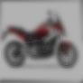
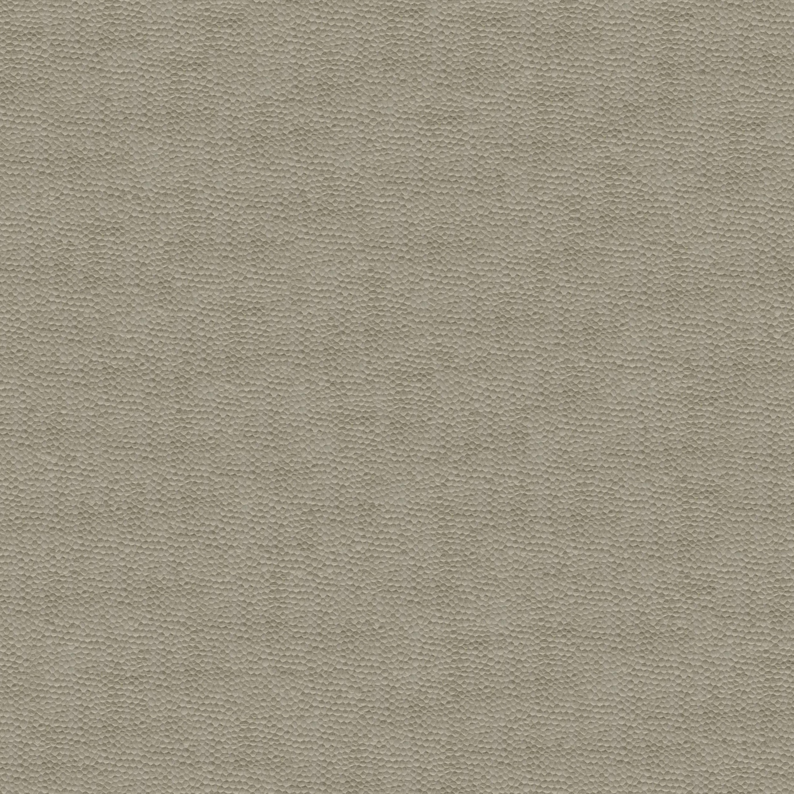
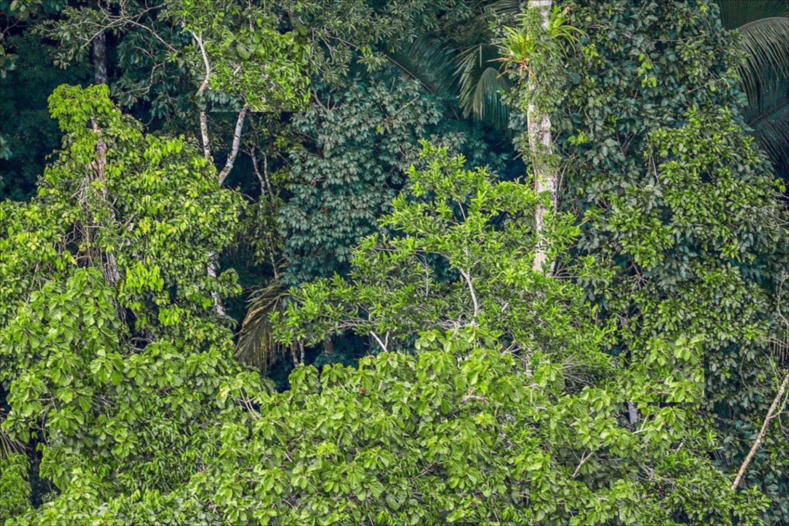

# Image_Processing_Course
Image Processing Course Assignments

## HW1
### Q1 and Q2
These questions are about enhancing two dark photo's qualities. The origianl images are quite dark and are not pleasent for human's eyes. So, I enchanced them using gamma transformation, contrast stretching thecniques. These are origianl images:

|   |  |
| ------------- | ------------- |

And the enhanced images are:

|   |  |
| ------------- | ------------- |

### Q3
In Q3 I wrote a code to convert [Prokudin-Gorskii](https://www.loc.gov/pictures/collection/prok/ "Prokudin-Gorskii images") black and white images to colory jpg images. The Prokudin-Gorskii' images are in .tif format with separated blue, red, and green channels. q3.py can convert them properly. I've choose Amir, Mosque and Train images to test program. These program converts a 16 bit image to 8 bit jpg colory image. I'v used gaussian pyramid to improve speed while preserving the accuracy. After finding best matches for each channel, we should clip each side with a proper value (since the sides of the original images are in a bad shape). This procedure is done automatically. 

The results are as below:
|   |  |  |
| ------------- | ------------- | ------------- |

### Q4
This program changes the flowers color to pink and blures the background:

|   |  |
| ------------- | ------------- |

### Q5
Filtering an image by using OpenCV filter2D function, using naive double-for-loop implementation, and matrix addition method (which is faster). The time for each method is written under each image:

| Opencv filter2D method | Double-for Method | Matrix Addition Method |
| ------------- | ------------- | ------------- |
|   |  |  |
| ‫‪0.01636419900000008‬‬s | ‫‪137.183767327‬‬s | ‫‪0.2271269970000276‬‬s |

### Q6
Histogram specification code to enhance an image's quality

|   |  |  | 
| ------------- | ------------- | ------------- |

## HW2

### Q1, Image sharpening techniques:
Image sharpaening using spatial and frequency domain tools. Original image is blured and we wish to sharp it using unsharp mask. This is the original, non sharp image:

The sharped images are as below:
|   |  |
| ------------- | ------------- |
|   |   |

### Q2, Simple template matching problem:
In this problem I used zero mean cross correlation method to match a given template with an image. The patch is a pipe which we want to find it in image. The result is as below:

### Q3:
In this problem we want to extract three books form an image. The books are rotated and there is a little perspective in the picture which makes it a bit hard to derive best results. I choosed every four corner of each book and fitted a homography transformation using opencv. Finally the image is warped using myWarpFunction - which I'v implemented it. The origianl image is:

And three extracted books are:
|   |  |  |
| ------------- | ------------- | --------------------- |

### Q4, Hybrid images:
Hybrid images are kind of delusional. From near, you can see an image. As you go back and get away from the image, it seems you are observing another image. It happens as we interpret details when we are close enough to the image while from distance we can only see the overall shape. The details are high frequent component in image and the overall shape is composed by low frequency components. So, I used it to generate hybrid images. You can find the article from [Here](https://stanford.edu/class/ee367/reading/OlivaTorralb_Hybrid_Siggraph06.pdf "Hybrid images article"). I choosed these images:

|   |  |
| ------------- | ------------- |

The motorcycle image will be seen from far while the bycicle image will be seen from near. The resulting hybrid image is:
|   |  |
| ------------- | ------------- |

The hybrid image is smalled so you can see what it will look like when you see it from a distance.

---
## HW3

### Q1, Hough Transform

In this problem, I tried to detect points on the squares of the chess area.
|   |  |
| ------------- | ------------- |

I've used hough transform tecnique along with extra methods to detect lines. Then I've found the intersection of each pair of lines. The code can work pretty on wide range of simillar images. Below you can see the results:

|   |  |
| ------------- | ------------- |

Although I haven't detected all of the coreners but the method is pretty image-independent and could be appiled to simillar images. For itermediate reults, refer to the `HW3` directory.

### Q2, Texture Synthesis
Synthesising `2500x2500` larg textures of a given small, less than `500x500` image has been done in this problem. Below are some of the given, small images:

|   |  |
| ------------- | ------------- |

The textures are generated by finding proepr patch at each step. First a small patch is selceted from source image. Next, by template matching, I find a proper patch which is simillar to the previous patch in terms of a thin right stripe in the right of it. After that, I merge two images by finding minimum cut in which the cost is minimized. This will eventually result in better visualization of the final image. 

By continuing this procedure, the first row of the target image is completed. Next, we should generate next rows. The only difference is the common area between filled part of the target image and source image changes. For the first patches of each row, the common area looks like a rectangle which is the lower part of the last completed row. For other patches, the common area is a L-shape area. The logic is the same only the common area changes at each step. 

Below are the results of performing the algorithm:

|   |  |
| ------------- | ------------- |

### Q3, Hole filling
Here we want to remove the person and birds from each image while the final result looks natural to human eyes. The source pictures are:

|   |  |
| ------------- | ------------- |

I've used the texture synthesis method which was explained in the previous part. The results looks like these:

|   |  |
| ------------- | ------------- |

Although the result isn't perfect and we must use other methods like Patch Match.

